# Bora Mobile World – E-commerce Store for Mobiles, Accessories & VIP Numbers

Welcome to **Bora Mobile World**, a modern and feature-rich e-commerce platform specially built for mobile phones, VIP phone numbers, and mobile accessories. This full-stack application offers a seamless shopping experience with an intuitive UI, secure authentication, and smooth payment processing.

---

## Features

### User Functionalities
- **User Registration & Login** – Secure authentication using JWT
- **Browse Products** – Mobiles, accessories, and VIP numbers with filter options
- **Add to Cart** – Manage items effortlessly
- **Checkout & Payment** – Integrated with Razorpay for secure transactions
- **Order History** – View all past purchases

### Admin Functionalities
- **Admin Registration & Login**
- **Add New Products**
- **Edit Product Details**
- **Delete Products**
- **View Order List**

---

## Tech Stack

### Frontend
- **React.js** 
- **Tailwind CSS** 
- **Redux Toolkit** 

### Backend
- **Node.js** & **Express.js** – RESTful API
- **MongoDB** – Product & user data storage
- **Razorpay** – Payment gateway integration

---

## UI Screenshots

| Screen Name          | Preview                                                  |
|----------------------|----------------------------------------------------------|
| Add to Cart          | 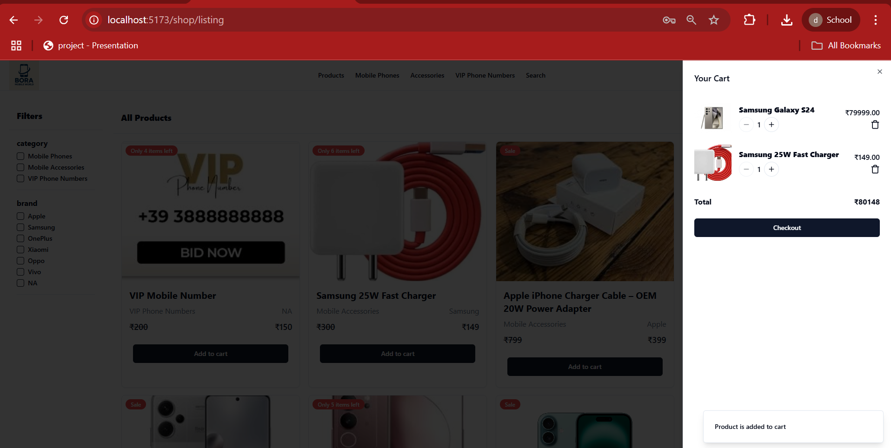        |
| Admin Dashboard      | 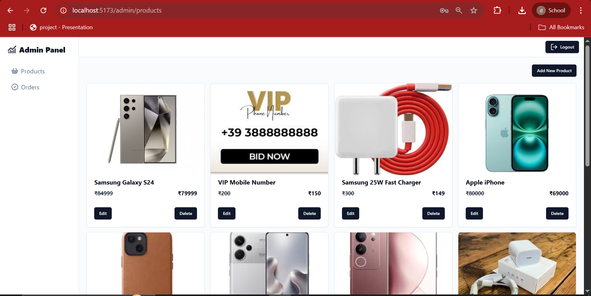    |
| Add Product          | 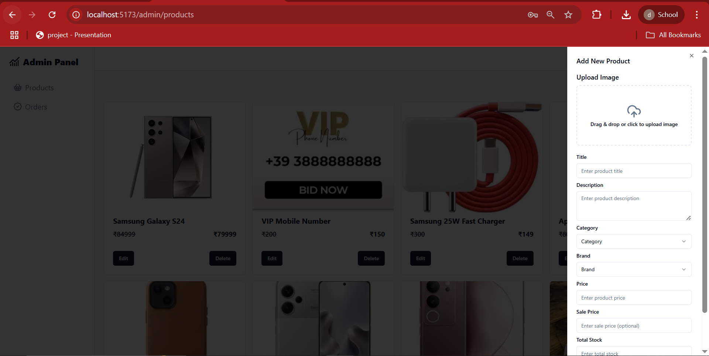        |
| Customer Dashboard   | 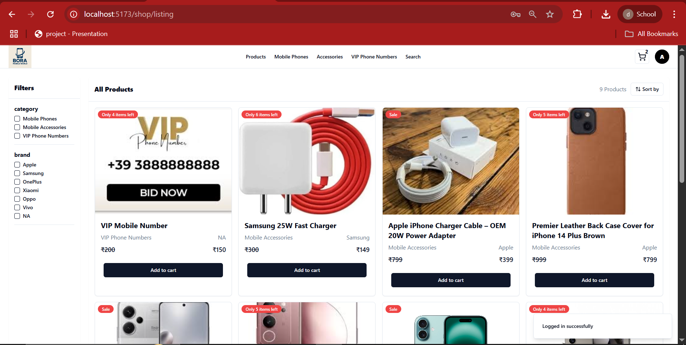 |
| Filters Applied      | 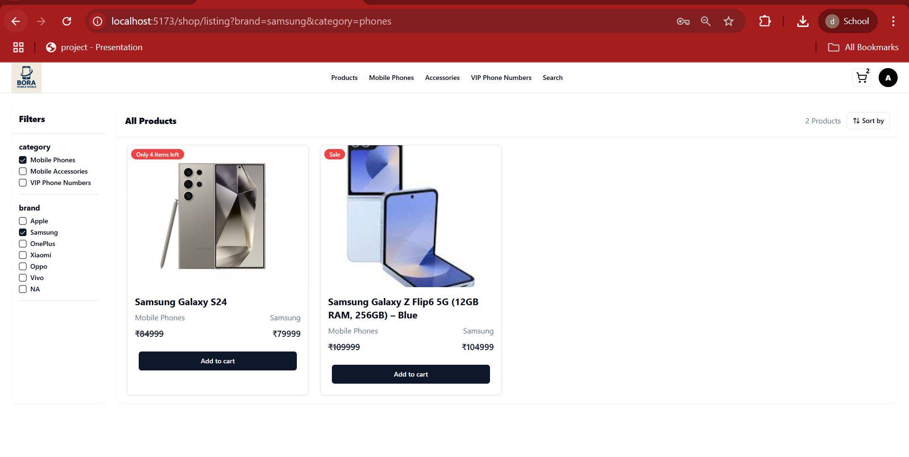            |
| Order Details        | 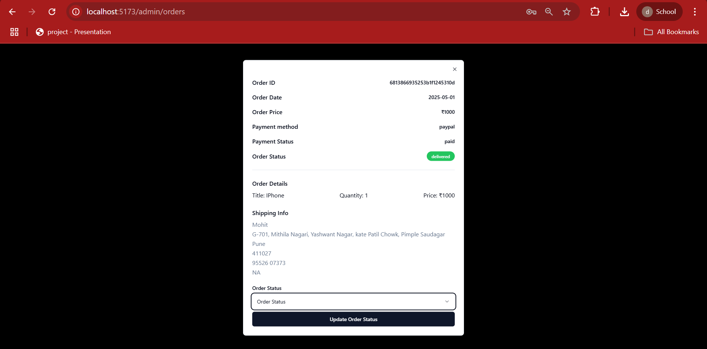        |
| Order List           | 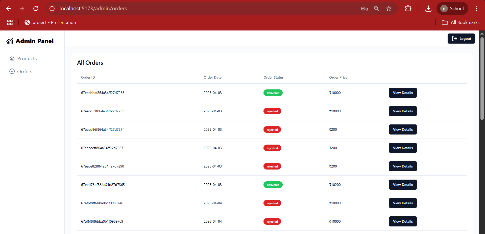              |
| Product Details      | 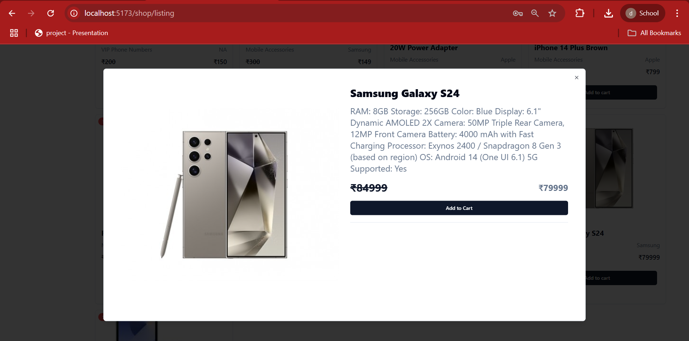    |
| Razorpay Payment     | 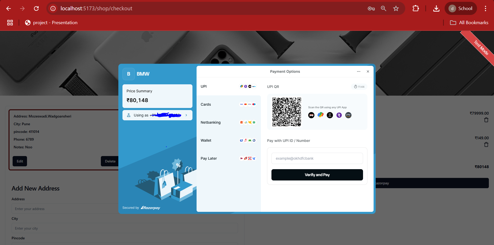         |
| Search Applied       | 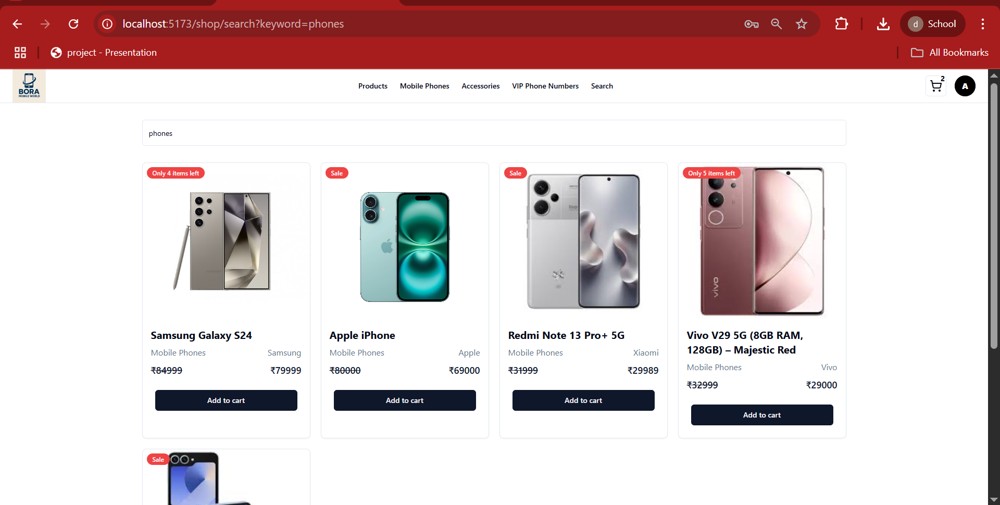              |
| Sign In Page         | 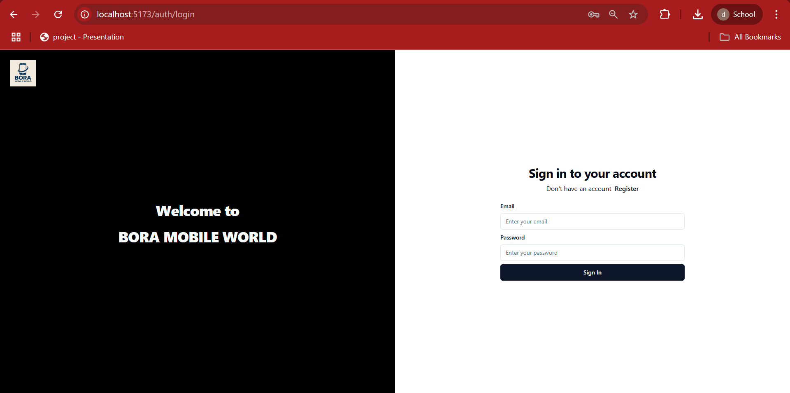               |
| Sign Up Page         | 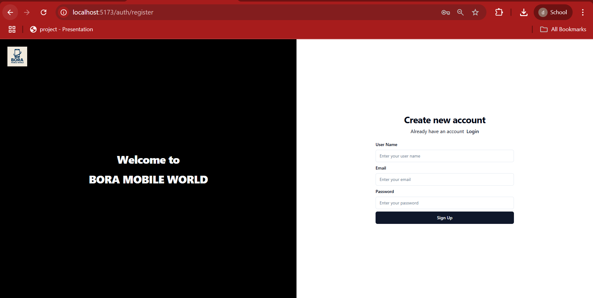               |
| Before Payment       | 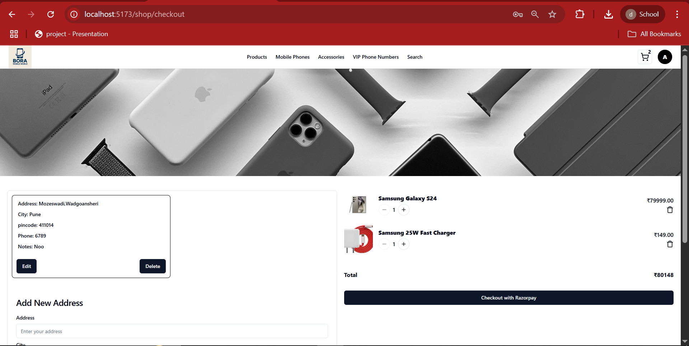 |

> Screenshots are stored in the `/screenshots` folder.

---

**How to Run Locally**

**1. Clone the Repository**

git clone https://github.com/DhanwantariChavan/bora-mobile-world.git

cd bora-mobile-world

**2. Start the Backend**

cd server

npm install

npm run dev

**3. Start the Frontend**

cd client

npm install

npm run dev

**Customization**

Project Name: Bora Mobile World

Domain: Mobile Phones, VIP Numbers & Accessories

**Future Enhancements**

> Wishlist / Save for Later

> Product Reviews & Ratings

> Email Notifications

> Delivery Tracking Integration

**Developer:**
Dhanwantari Chavan
